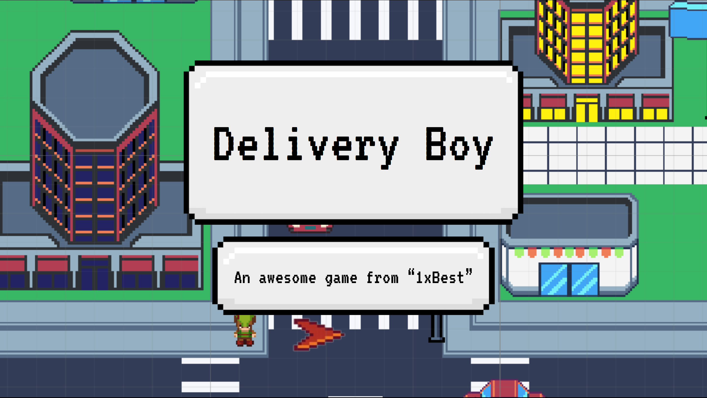
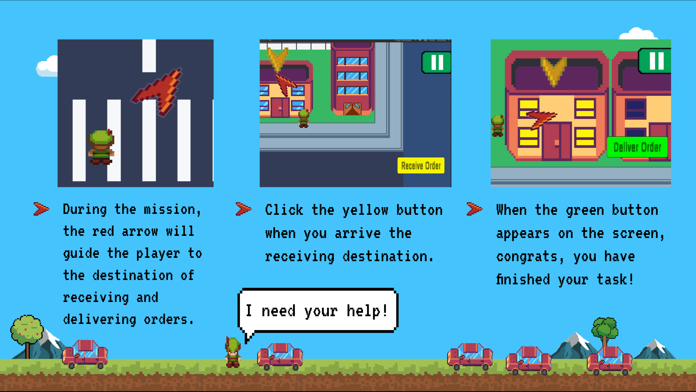

# Delivery Boy

## Overview

"Delivery Boy" is a mobile arcade game developed using Unity. Set in the dense traffic of Vietnam, players control Cat Khanh, an employee of the “1xBest” delivery company, and navigate through city blocks to complete deliveries within a strict time frame. This project encapsulates both the challenges of being a delivery boy and the thrilling, fast-paced gameplay that is sure to keep players engaged and entertained.

This project was developed as part of the course "Introduction to Software Engineering" at Hanoi University of Science and Technology. The project was developed by 1xBest, a team of 6 students:

- [Hồ Minh Khôi](https://github.com/hmkhoi2701)
- [Nguyễn Ngọc Toàn](https://github.com/nntoan209)
- [Trương Quang Bình](https://github.com/quangbinh113)
- [Trần Cát Khánh](https://github.com/khanhha1005)
- [Nguyễn Thiên Hoàn](https://github.com/Bigbynth)
- [Phạm Tiến Sơn](https://github.com/phamson02)

## Storyline

Cat Khanh faces the task of navigating the challenging traffic of Vietnam to fulfill his deliveries on time, in line with the policies of the “1xBest” delivery company that prioritize speed over employee safety. Players are thrown into the heart of the action, and must dodge oncoming traffic, pedestrians and other obstacles to ensure that each delivery reaches its destination within the set time limit. Your mission is to help Khanh master his navigation skills, and ensure that each delivery is successfully completed. Do you have what it takes to help him accomplish his job?

## Gameplay

In "Delivery Boy", players control Cat Khanh across a minimalized city block. The shop's location is fixed at each level, but the delivery locations are randomly generated. The objective is to dodge traffic while crossing roads to deliver the goods within a strict time frame. It's a test of reflexes, strategy, and a bit of luck.

For more screenshots, please follow this [link](./docs/screenshots.md).

## Download the Game

You can download the APK of the game using [this link](https://drive.google.com/file/d/137IxJR-sbTB6c_pwvJ5bRBdKUMWrY72d/view?usp=sharing).

## Getting Started

You will need to have Unity installed to open and run this project. Once you've done that, you can clone this repository and open the project in Unity. Then, simply hit play to start testing the game!

## Building the Project

1. Open Unity and load the project.
2. Navigate to File -> Build Settings.
3. Select Android or iOS based on your preference.
4. Click on 'Build' and select the output folder.

## Contributing

We are more than happy to accept external contributions to the project in the form of feedback, bug reports and even better - pull requests. If you find a bug in the project (and you don't have the time or skills to fix it), please submit an issue in the GitHub issue tracker.

## Feedback

Any feedback about the gameplay, design or any other aspect of "Delivery Boy" is greatly appreciated. Feel free to reach out to us via our GitHub profiles or send an email.

## License

This project is licensed under the MIT License. See the [LICENSE](LICENSE) file for details.

## Acknowledgments

We would like to thank the entire team for their dedication and hard work on this project, as well as the Unity community for their invaluable resources and support.

Remember, Cat Khanh is depending on you. So download the game, and get to work!
