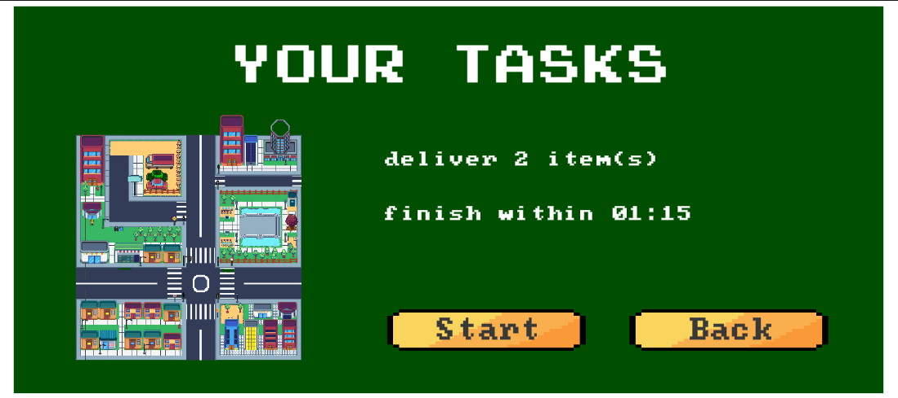

# Screenshots of "Delivery Boy"

Welcome to the screenshot gallery of "Delivery Boy" - a mobile arcade game that takes you through the dense streets of Vietnam. Here, you can get a closer look at the minimalist yet dynamic graphical representation of the game.

## Main Menu Screen

This is the first screen you see when you launch the game. Here, you can start playing, check out the tutorial or tweak the game settings.

## Gameplay

The core gameplay revolves around controlling Cat Khanh, navigating through the bustling city streets, dodging traffic to complete the deliveries within the strict timeframe.

## Level Completion

A snapshot of the screen you'll see once you successfully complete a delivery.

## Game Over

And of course, the inevitable game over screen. But remember, each loss is a new opportunity to strategize and come back stronger!

We hope these screenshots provide a good glimpse into the world of "Delivery Boy". Download the game [here](https://drive.google.com/file/d/137IxJR-sbTB6c_pwvJ5bRBdKUMWrY72d/view?usp=sharing) and start your own delivery journey now!
